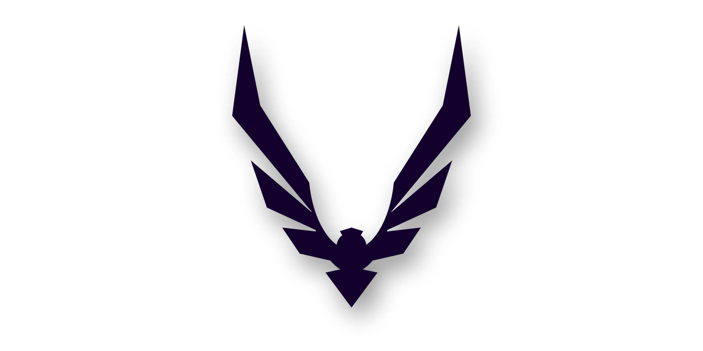

# Raven V

### Raven V isn't just another Raven build with 2 new modules... 
V fully re-writes of many Raven's core architectures and adds a translation layer which allows for kotlin based liquidbounce modules to be run as if they were Raven modules.

To-do:
- All of that.


## Building

```bash
./gradlew build
```
